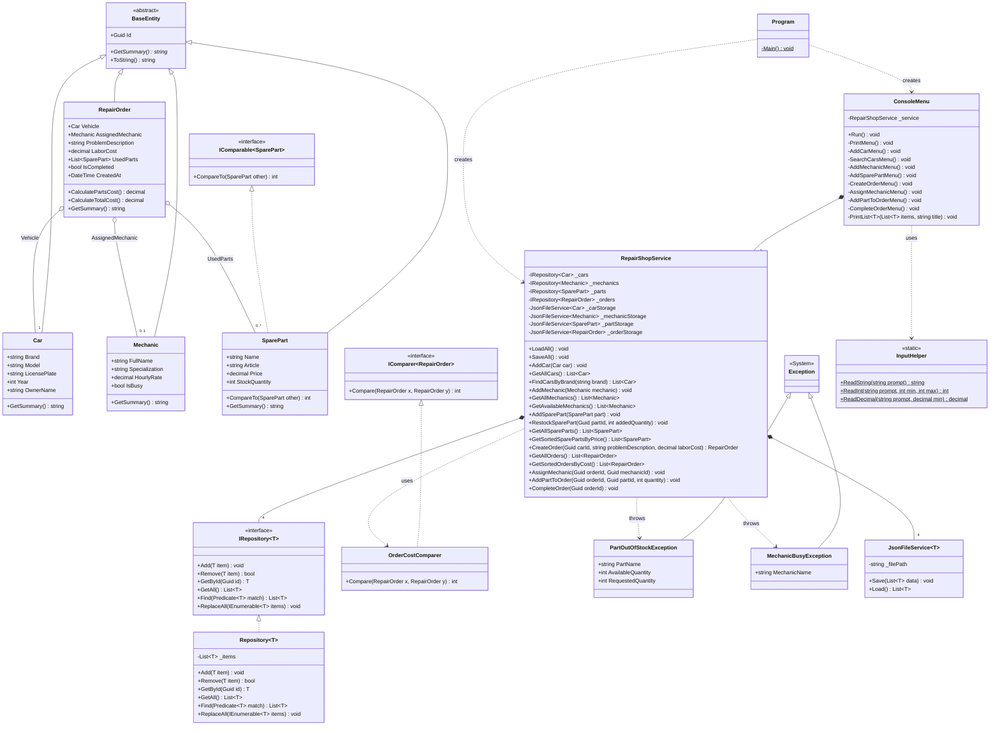

```mermaid
classDiagram
    class BaseEntity {
        <<abstract>>
        +Guid Id
        +GetSummary()* string
        +ToString() string
    }

    class Car {
        +string Brand
        +string Model
        +string LicensePlate
        +int Year
        +string OwnerName
        +GetSummary() string
    }

    class Mechanic {
        +string FullName
        +string Specialization
        +decimal HourlyRate
        +bool IsBusy
        +GetSummary() string
    }

    class IComparable~SparePart~ {
        <<interface>>
        +CompareTo(SparePart other) int
    }

    class SparePart {
        +string Name
        +string Article
        +decimal Price
        +int StockQuantity
        +CompareTo(SparePart other) int
        +GetSummary() string
    }

    class RepairOrder {
        +Car Vehicle
        +Mechanic AssignedMechanic
        +string ProblemDescription
        +decimal LaborCost
        +List~SparePart~ UsedParts
        +bool IsCompleted
        +DateTime CreatedAt
        +CalculatePartsCost() decimal
        +CalculateTotalCost() decimal
        +GetSummary() string
    }

    class IRepository~T~ {
        <<interface>>
        +Add(T item) void
        +Remove(T item) bool
        +GetById(Guid id) T
        +GetAll() List~T~
        +Find(Predicate~T~ match) List~T~
        +ReplaceAll(IEnumerable~T~ items) void
    }

    class Repository~T~ {
        -List~T~ _items
        +Add(T item) void
        +Remove(T item) bool
        +GetById(Guid id) T
        +GetAll() List~T~
        +Find(Predicate~T~ match) List~T~
        +ReplaceAll(IEnumerable~T~ items) void
    }

    class IComparer~RepairOrder~ {
        <<interface>>
        +Compare(RepairOrder x, RepairOrder y) int
    }

    class OrderCostComparer {
        +Compare(RepairOrder x, RepairOrder y) int
    }

    class Exception {
        <<System>>
    }

    class PartOutOfStockException {
        +string PartName
        +int AvailableQuantity
        +int RequestedQuantity
    }

    class MechanicBusyException {
        +string MechanicName
    }

    class JsonFileService~T~ {
        -string _filePath
        +Save(List~T~ data) void
        +Load() List~T~
    }

    class RepairShopService {
        -IRepository~Car~ _cars
        -IRepository~Mechanic~ _mechanics
        -IRepository~SparePart~ _parts
        -IRepository~RepairOrder~ _orders
        -JsonFileService~Car~ _carStorage
        -JsonFileService~Mechanic~ _mechanicStorage
        -JsonFileService~SparePart~ _partStorage
        -JsonFileService~RepairOrder~ _orderStorage
        +LoadAll() void
        +SaveAll() void
        +AddCar(Car car) void
        +GetAllCars() List~Car~
        +FindCarsByBrand(string brand) List~Car~
        +AddMechanic(Mechanic mechanic) void
        +GetAllMechanics() List~Mechanic~
        +GetAvailableMechanics() List~Mechanic~
        +AddSparePart(SparePart part) void
        +RestockSparePart(Guid partId, int addedQuantity) void
        +GetAllSpareParts() List~SparePart~
        +GetSortedSparePartsByPrice() List~SparePart~
        +CreateOrder(Guid carId, string problemDescription, decimal laborCost) RepairOrder
        +GetAllOrders() List~RepairOrder~
        +GetSortedOrdersByCost() List~RepairOrder~
        +AssignMechanic(Guid orderId, Guid mechanicId) void
        +AddPartToOrder(Guid orderId, Guid partId, int quantity) void
        +CompleteOrder(Guid orderId) void
    }

    class ConsoleMenu {
        -RepairShopService _service
        +Run() void
        -PrintMenu() void
        -AddCarMenu() void
        -SearchCarsMenu() void
        -AddMechanicMenu() void
        -AddSparePartMenu() void
        -CreateOrderMenu() void
        -AssignMechanicMenu() void
        -AddPartToOrderMenu() void
        -CompleteOrderMenu() void
        -PrintList~T~(List~T~ items, string title) void
    }

    class InputHelper {
        <<static>>
        +ReadString(string prompt)$ string
        +ReadInt(string prompt, int min, int max)$ int
        +ReadDecimal(string prompt, decimal min)$ decimal
    }

    class Program {
        -Main()$ void
    }

    BaseEntity <|-- Car
    BaseEntity <|-- Mechanic
    BaseEntity <|-- SparePart
    BaseEntity <|-- RepairOrder

    IComparable~SparePart~ <|.. SparePart
    IRepository~T~ <|.. Repository~T~
    IComparer~RepairOrder~ <|.. OrderCostComparer

    Exception <|-- PartOutOfStockException
    Exception <|-- MechanicBusyException

    RepairOrder o-- "1" Car : Vehicle
    RepairOrder o-- "0..1" Mechanic : AssignedMechanic
    RepairOrder o-- "0..*" SparePart : UsedParts

    RepairShopService *-- "4" IRepository~T~
    RepairShopService *-- "4" JsonFileService~T~
    RepairShopService ..> OrderCostComparer : uses
    RepairShopService ..> PartOutOfStockException : throws
    RepairShopService ..> MechanicBusyException : throws

    ConsoleMenu *-- "1" RepairShopService
    ConsoleMenu ..> InputHelper : uses
    Program ..> RepairShopService : creates
    Program ..> ConsoleMenu : creates
```